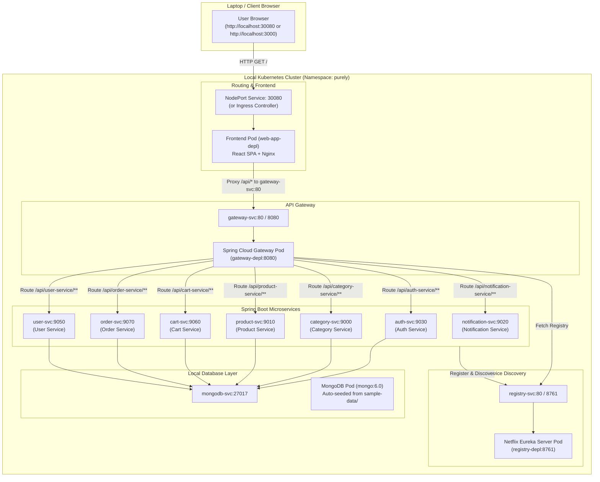

# 📦 Local Kubernetes Implementation & Deployment Guide

A comprehensive, technical guide detailing all architectural changes, local Kubernetes manifests, automation scripts, and step-by-step workflows implemented to run the **Purely Fullstack Microservices E-Commerce Web Application** locally on your laptop without cloud dependencies.

---

## 📑 Table of Contents

1. [Overview & Architecture](#-overview--architecture)
2. [What Changes Were Made & Why](#-what-changes-were-made--why)
   - [1. Frontend Nginx Reverse Proxy](#1-frontend-nginx-reverse-proxy)
   - [2. In-Cluster MongoDB with Auto-Seeding](#2-in-cluster-mongodb-with-auto-seeding)
   - [3. Dedicated Local Kubernetes Manifests (`k8s-local/`)](#3-dedicated-local-kubernetes-manifests-k8s-local)
   - [4. Cross-Platform Automation Scripts (`scripts/`)](#4-cross-platform-automation-scripts-scripts)
   - [5. Resource Requests & Limits Tuning](#5-resource-requests--limits-tuning)
3. [Component Breakdown](#-component-breakdown)
4. [Step-by-Step Local Deployment Guide](#-step-by-step-local-deployment-guide)
   - [Prerequisites](#prerequisites)
   - [Step 1: Start Cluster & Set Context](#step-1-start-cluster--set-context)
   - [Step 2: Build Container Images](#step-2-build-container-images)
   - [Step 3: Deploy to Kubernetes](#step-3-deploy-to-kubernetes)
   - [Step 4: Access the Application](#step-4-access-the-application)
5. [Verification, Health-Checks & Testing](#-verification-health-checks--testing)
6. [Troubleshooting Common Issues](#-troubleshooting-common-issues)
7. [Cleanup & Teardown](#-cleanup--teardown)

---

## 🏛️ Overview & Architecture

Originally, this repository was designed for **AWS EKS** deployments utilizing:
- Amazon ECR for container registries
- AWS Application Load Balancer (ALB) controller for Ingress routing
- MongoDB Atlas (Cloud) for persistence
- GitHub Actions CI/CD for image builds and Helm releases

### Local Kubernetes Architecture Diagram

To make the application 100% self-contained, offline-capable, and runnable on a laptop (via **Docker Desktop Kubernetes**, **Minikube**, or **Kind**), the architecture was adapted as follows:



---

## 🛠️ What Changes Were Made & Why

### 1. Frontend Nginx Reverse Proxy
- **File Modified**: [`frontend/nginx/default.conf`](file:///c:/Users/riyag/Fullstack-E-commerce-web-app/frontend/nginx/default.conf)
- **Problem**: In AWS, an Application Load Balancer (ALB) handles routing by sending `/` traffic to the frontend and `/api/*` traffic to the API gateway. On a local laptop without an ALB controller, accessing the frontend directly via NodePort or Port-Forwarding resulted in broken API calls because browser requests to `/api` had nowhere to go.
- **Solution**: Configured the Frontend's Nginx server to act as a reverse proxy:
  ```nginx
  location /api/ {
      proxy_pass http://gateway-svc:80;
      proxy_set_header Host $host;
      proxy_set_header X-Real-IP $remote_addr;
      proxy_set_header X-Forwarded-For $proxy_add_x_forwarded_for;
      proxy_set_header X-Forwarded-Proto $scheme;
  }
  ```
- **Benefit**: Any user accessing `http://localhost:30080` or `http://localhost:3000` automatically has all `/api/` calls routed internally to the API Gateway with zero CORS or host-mismatch issues.

---

### 2. In-Cluster MongoDB with Auto-Seeding
- **File Created**: [`k8s-local/01-mongodb.yaml`](file:///c:/Users/riyag/Fullstack-E-commerce-web-app/k8s-local/01-mongodb.yaml)
- **Problem**: The original application required a MongoDB Atlas cloud cluster with separate connection strings configured per service.
- **Solution**: Created a local MongoDB deployment (`mongo:6.0`) with a `ConfigMap` (`mongodb-init-data`) containing:
  - `categories.json` (from `sample-data/purely_category_service.categories.json`)
  - `products.json` (from `sample-data/purely_product_service.products.json`)
  - An init script `init.sh` mounted into `/docker-entrypoint-initdb.d/` that automatically runs `mongoimport` on container startup.
- **Benefit**: The local environment comes pre-loaded with categories and products immediately on first launch.

---

### 3. Dedicated Local Kubernetes Manifests (`k8s-local/`)
Created a modular directory of clean, standard Kubernetes manifests tailored for local development:

| Manifest File | Kind / Resources | Purpose |
|---------------|------------------|---------|
| [`00-namespace.yaml`](file:///c:/Users/riyag/Fullstack-E-commerce-web-app/k8s-local/00-namespace.yaml) | `Namespace` | Creates isolated `purely` namespace. |
| [`01-mongodb.yaml`](file:///c:/Users/riyag/Fullstack-E-commerce-web-app/k8s-local/01-mongodb.yaml) | `Deployment`, `Service`, `ConfigMap` | Local MongoDB (`mongodb-svc:27017`) and auto-seed data. |
| [`02-service-registry.yaml`](file:///c:/Users/riyag/Fullstack-E-commerce-web-app/k8s-local/02-service-registry.yaml) | `Deployment`, `Service` | Netflix Eureka server (`registry-svc:8761`). |
| [`03-config-and-secrets.yaml`](file:///c:/Users/riyag/Fullstack-E-commerce-web-app/k8s-local/03-config-and-secrets.yaml) | `ConfigMap`, `Secret` | Centralized database connection strings, Eureka defaultZone, and credentials. |
| [`04-backend-services.yaml`](file:///c:/Users/riyag/Fullstack-E-commerce-web-app/k8s-local/04-backend-services.yaml) | `Deployment` (x7), `Service` (x7) | Microservices: Auth, Category, Product, Cart, Order, User, Notification. |
| [`05-api-gateway.yaml`](file:///c:/Users/riyag/Fullstack-E-commerce-web-app/k8s-local/05-api-gateway.yaml) | `Deployment`, `Service` | Spring Cloud Gateway (`gateway-svc:8080`, port 80). |
| [`06-frontend.yaml`](file:///c:/Users/riyag/Fullstack-E-commerce-web-app/k8s-local/06-frontend.yaml) | `Deployment`, `Service` | React Web App (`web-app-svc:80`, `NodePort: 30080`). |
| [`07-ingress.yaml`](file:///c:/Users/riyag/Fullstack-E-commerce-web-app/k8s-local/07-ingress.yaml) | `Ingress` | Standard NGINX Ingress rules for clusters with Ingress controllers. |
| [`kustomization.yaml`](file:///c:/Users/riyag/Fullstack-E-commerce-web-app/k8s-local/kustomization.yaml) | `Kustomization` | Enables one-command deploy with `kubectl apply -k k8s-local/`. |

---

### 4. Cross-Platform Automation Scripts (`scripts/`)
Automated all repetitive CLI tasks with PowerShell (`.ps1`) for Windows and Bash (`.sh`) for macOS/Linux/WSL:

- **Build Images**: [`scripts/build-images.ps1`](file:///c:/Users/riyag/Fullstack-E-commerce-web-app/scripts/build-images.ps1) & [`scripts/build-images.sh`](file:///c:/Users/riyag/Fullstack-E-commerce-web-app/scripts/build-images.sh)  
  Iterates through all 10 components and runs `docker build` with standard local tags (`purely/<service>:latest`).
- **Deploy**: [`scripts/deploy-local.ps1`](file:///c:/Users/riyag/Fullstack-E-commerce-web-app/scripts/deploy-local.ps1) & [`scripts/deploy-local.sh`](file:///c:/Users/riyag/Fullstack-E-commerce-web-app/scripts/deploy-local.sh)  
  Applies resources in dependency order (Namespace -> DB -> Registry -> Config -> Services -> Gateway -> Frontend) and waits for pods to reach `Ready` state.
- **Port Forwarding**: [`scripts/port-forward.ps1`](file:///c:/Users/riyag/Fullstack-E-commerce-web-app/scripts/port-forward.ps1) & [`scripts/port-forward.sh`](file:///c:/Users/riyag/Fullstack-E-commerce-web-app/scripts/port-forward.sh)  
  Binds standard localhost ports (`3000` for Web UI, `8761` for Eureka, `8080` for API Gateway).
- **Teardown**: [`scripts/teardown-local.ps1`](file:///c:/Users/riyag/Fullstack-E-commerce-web-app/scripts/teardown-local.ps1) & [`scripts/teardown-local.sh`](file:///c:/Users/riyag/Fullstack-E-commerce-web-app/scripts/teardown-local.sh)  
  Deletes the `purely` namespace and frees all laptop RAM/CPU.

---

### 5. Resource Requests & Limits Tuning
Each Spring Boot service and frontend container has been tuned to avoid exhausting laptop RAM:
- CPU Request: `100m` – `150m` | CPU Limit: `500m`
- Memory Request: `128Mi` – `256Mi` | Memory Limit: `512Mi`
- Total Cluster RAM Footprint: ~2.5 GB to 3.5 GB (comfortable for standard 8GB–16GB laptops).

---

## 🔍 Component Breakdown

| Service | Port | Technology | Database / Dependency |
|---------|------|------------|-----------------------|
| `web-app` | `80` (NodePort `30080`) | React, Vite, Nginx | Proxies `/api/*` to `gateway-svc` |
| `api-gateway` | `8080` (ClusterIP `80`) | Spring Cloud Gateway | Eureka Service Discovery |
| `service-registry`| `8761` (ClusterIP `80`) | Spring Netflix Eureka | Centralized Service Registry |
| `auth-service` | `9030` | Spring Boot, JWT | `purely_auth_service` (MongoDB) |
| `category-service`| `9000` | Spring Boot | `purely_category_service` (MongoDB) |
| `product-service` | `9010` | Spring Boot | `purely_product_service` (MongoDB) |
| `cart-service` | `9060` | Spring Boot, OpenFeign | `purely_cart_service` (MongoDB) |
| `order-service` | `9070` | Spring Boot, OpenFeign | `purely_order_service` (MongoDB) |
| `user-service` | `9050` | Spring Boot | `purely_user_service` (MongoDB) |
| `notification-service` | `9020` | Spring Boot, JavaMail | SMTP / Gmail credentials |
| `mongodb` | `27017` | MongoDB 6.0 | Local in-cluster storage |

---

## 🚀 Step-by-Step Local Deployment Guide

### Prerequisites
1. **Docker Desktop** installed on Windows (or Minikube / Kind).
2. **kubectl** CLI installed.
3. **PowerShell** (Windows) or **Bash** (macOS/Linux/WSL).

---

### Step 1: Start Cluster & Set Context

#### Using Docker Desktop (Recommended on Windows):
1. Launch **Docker Desktop**.
2. Go to **Settings (⚙️) > Kubernetes**.
3. Check **Enable Kubernetes** and click **Apply & restart**.
4. In your PowerShell terminal, set context:
   ```powershell
   kubectl config use-context docker-desktop
   ```
5. Verify cluster is active:
   ```powershell
   kubectl cluster-info
   ```

#### Alternative: Using Minikube:
```powershell
minikube start --cpus=4 --memory=8192
kubectl config use-context minikube
```

#### Alternative: Using Kind:
```powershell
kind create cluster --name purely
kubectl config use-context kind-purely
```

---

### Step 2: Build Container Images

Build all 10 Docker images locally:

**PowerShell (Windows):**
```powershell
.\scripts\build-images.ps1
```

**Bash (Linux / macOS / WSL):**
```bash
chmod +x ./scripts/*.sh
./scripts/build-images.sh
```

*(If using Minikube or Kind, load images into the cluster node using `minikube image load <tag>` or `kind load docker-image <tag>`)*.

---

### Step 3: Deploy to Kubernetes

Deploy all resources:

**PowerShell (Windows):**
```powershell
.\scripts\deploy-local.ps1
```

**Bash (Linux / macOS / WSL):**
```bash
./scripts/deploy-local.sh
```

Or using `kubectl`:
```powershell
kubectl apply -k k8s-local/
```

---

### Step 4: Access the Application

#### Option A: Direct NodePort URL (No extra commands needed)
Open your browser and navigate to:
👉 **[http://localhost:30080](http://localhost:30080)**

#### Option B: Port Forwarding Helper (Standard Ports)
Run:
```powershell
.\scripts\port-forward.ps1
```
Now access:
- **Web Application**: [http://localhost:3000](http://localhost:3000)
- **Eureka Service Registry**: [http://localhost:8761](http://localhost:8761)
- **API Gateway**: [http://localhost:8080](http://localhost:8080)

---

## 🧪 Verification, Health-Checks & Testing

### 1. Check Pod Status
```powershell
kubectl get pods -n purely
```
All 11 pods (`mongodb`, `registry`, `auth`, `category`, `product`, `cart`, `order`, `user`, `notification`, `gateway`, `web-app`) should show `STATUS: Running` and `READY: 1/1`.

### 2. Verify Service Discovery
Open the Eureka dashboard at **[http://localhost:8761](http://localhost:8761)** (with port forwarding running).  
Verify that all services are listed under **Instances currently registered with Eureka**:
- `API-GATEWAY`
- `AUTH-SERVICE`
- `CATEGORY-SERVICE`
- `PRODUCT-SERVICE`
- `CART-SERVICE`
- `ORDER-SERVICE`
- `USER-SERVICE`
- `NOTIFICATION-SERVICE`

### 3. Verify Frontend & Pre-Seeded Data
1. Open **[http://localhost:30080](http://localhost:30080)** or **[http://localhost:3000](http://localhost:3000)**.
2. Verify category cards appear on the homepage (*Fitness Equipment, Nutrition, Personal Care, Mental Wellness, Home Gym Essentials*).
3. Browse products (*Yoga Mat, Dumbbells Set, Protein Powder, Vitamin C Tablets, etc.*).
4. Register a new account / Log in.
5. Add items to your cart and complete checkout.

---

## 🔧 Troubleshooting Common Issues

| Issue / Symptom | Root Cause | Solution |
|-----------------|------------|----------|
| `Cannot connect to server` on `kubectl` | `kubectl` context is pointing to an old remote cluster or Docker Desktop is stopped. | Run `kubectl config use-context docker-desktop` and ensure Docker Desktop shows "Kubernetes running". |
| `ErrImageNeverPull` or `ImagePullBackOff` | Docker images have not been built locally yet. | Run `.\scripts\build-images.ps1` to build all images. |
| Categories/Products show empty on UI | MongoDB seed script hasn't completed or pod restarted with empty volume. | Check MongoDB logs: `kubectl logs -n purely -l app=mongodb`. |
| API requests return `404` or `500` | Microservices still initializing or not yet registered with Eureka. | Wait 30–60 seconds for Spring Boot startup and Eureka heartbeat registration. |
| Cannot access `http://localhost:30080` | Minikube users need tunnel, or port is blocked. | For Minikube: run `minikube service web-app-svc -n purely`. Or run `.\scripts\port-forward.ps1` and use `http://localhost:3000`. |

---

## 🧹 Cleanup & Teardown

To delete all pods, services, secrets, and the `purely` namespace:

**PowerShell (Windows):**
```powershell
.\scripts\teardown-local.ps1
```

**Bash (Linux / macOS / WSL):**
```bash
./scripts/teardown-local.sh
```
