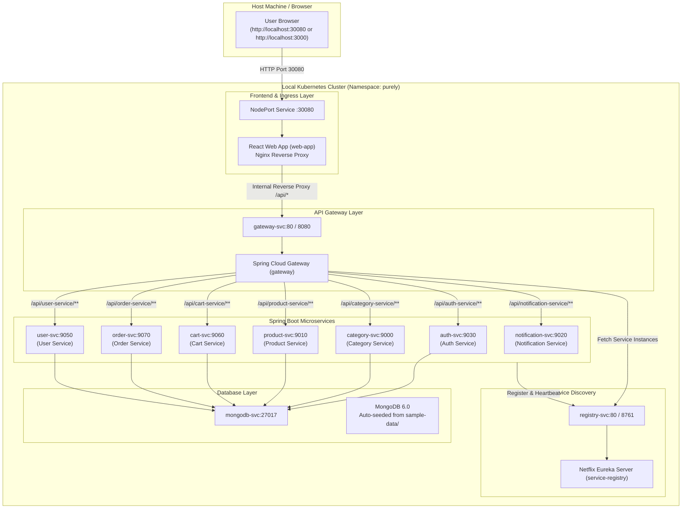

# 🛍️ Purely — Fullstack Microservices E-Commerce Web Application

<p align="center">
  
  
  
  
  
  
  
</p>

---

## 📖 Overview

**Purely** is a production-grade, fullstack e-commerce web application engineered with a distributed microservices architecture. It is fully configured and optimized to run out-of-the-box on **local Kubernetes clusters** (Docker Desktop Kubernetes, Minikube, or Kind) without requiring any external cloud providers.

### 🌟 Key Capabilities
- **Distributed Microservices**: Individual Spring Boot services for Auth, Catalog, Products, Cart, Orders, Users, and Notifications.
- **Dynamic Service Discovery & Routing**: Netflix Eureka Service Registry and Spring Cloud Gateway dynamically register and route requests.
- **Frontend Reverse Proxy**: Nginx container serving the React SPA with built-in reverse proxying for all `/api/*` endpoints to eliminate CORS and port conflicts.
- **In-Cluster MongoDB with Auto-Seeding**: Automatic initialization with sample categories, products, and schemas upon startup.
- **Developer-Friendly Scripts**: One-click build, deploy, port-forward, and teardown scripts for both **PowerShell (Windows)** and **Bash (macOS/Linux/WSL)**.
- **Resource Optimized**: Tuned container memory and CPU requests/limits to comfortably run on standard 8GB–16GB laptops (~2.5–3.5 GB RAM total).

---

## 🏛️ System Architecture



---

## 📦 Component Matrix

| Service | Container Port | Service Port | Technology Stack | Database / Role |
| :--- | :--- | :--- | :--- | :--- |
| **`web-app`** | `80` | `30080` (NodePort) | React, Vite, Nginx | Frontend SPA + `/api/*` reverse proxy |
| **`api-gateway`** | `8080` | `80` / `8080` | Spring Cloud Gateway | Unified routing & filter enforcement |
| **`service-registry`** | `8761` | `80` / `8761` | Spring Netflix Eureka | Service discovery & registration |
| **`auth-service`** | `9030` | `9030` | Spring Boot, JWT, BCrypt | `purely_auth_service` (MongoDB) |
| **`category-service`** | `9000` | `9000` | Spring Boot | `purely_category_service` (MongoDB) |
| **`product-service`** | `9010` | `9010` | Spring Boot | `purely_product_service` (MongoDB) |
| **`cart-service`** | `9060` | `9060` | Spring Boot, OpenFeign | `purely_cart_service` (MongoDB) |
| **`order-service`** | `9070` | `9070` | Spring Boot, OpenFeign | `purely_order_service` (MongoDB) |
| **`user-service`** | `9050` | `9050` | Spring Boot | `purely_user_service` (MongoDB) |
| **`notification-service`** | `9020` | `9020` | Spring Boot, JavaMail | Order emails & notifications |
| **`mongodb`** | `27017` | `27017` | MongoDB 6.0 | In-cluster storage pre-loaded with data |

---

## 📂 Repository Structure

```
Fullstack-E-commerce-web-app/
├── assets/                         # Architecture diagrams & screenshots
├── frontend/                       # React SPA source code, Nginx config & Dockerfile
│   ├── nginx/
│   │   └── default.conf            # Nginx reverse proxy configuration
│   ├── src/                        # React UI components, contexts, pages, routes
│   └── Dockerfile                  # Multi-stage production build Dockerfile
├── k8s-local/                      # Clean local Kubernetes manifests
│   ├── 00-namespace.yaml           # Namespace: purely
│   ├── 01-mongodb.yaml             # MongoDB deployment, service & auto-seed init
│   ├── 02-service-registry.yaml    # Netflix Eureka deployment & service
│   ├── 03-config-and-secrets.yaml  # Centralized environment configs & secrets
│   ├── 04-backend-services.yaml    # 7 Spring Boot microservice deployments & services
│   ├── 05-api-gateway.yaml         # API Gateway deployment & service
│   ├── 06-frontend.yaml            # React frontend deployment & NodePort service (30080)
│   ├── 07-ingress.yaml             # Standard NGINX Ingress manifest (optional)
│   └── kustomization.yaml          # Kustomize manifest for single-command deploy
├── microservice-backend/           # Java Spring Boot microservices source code
│   ├── api-gateway/
│   ├── auth-service/
│   ├── cart-service/
│   ├── category-service/
│   ├── notification-service/
│   ├── order-service/
│   ├── product-service/
│   ├── service-registry/
│   └── user-service/
├── sample-data/                    # Sample JSON datasets for category & product catalog
│   ├── purely_category_service.categories.json
│   └── purely_product_service.products.json
├── scripts/                        # Cross-platform deployment & helper scripts
│   ├── build-images.ps1 / .sh      # Builds all 10 Docker images locally
│   ├── deploy-local.ps1 / .sh      # Deploys manifests in dependency order
│   ├── port-forward.ps1 / .sh      # Optional helper for standard localhost ports
│   └── teardown-local.ps1 / .sh    # Cleans up namespace and frees RAM/CPU
├── .gitignore
├── LICENSE
└── README.md
```

---

## 📋 Prerequisites

Before running the application, ensure you have the following installed:

1. **Docker Desktop** (or **Minikube** / **Kind**).
2. **Kubernetes CLI (`kubectl`)**.
3. **PowerShell** (Windows) or **Bash** (macOS/Linux/WSL).

---

## 🚀 Step-by-Step Local Deployment

### Step 1: Enable & Verify Local Kubernetes

#### Option A: Docker Desktop (Recommended on Windows & macOS)
1. Open **Docker Desktop**.
2. Navigate to **Settings (⚙️) > Kubernetes**.
3. Check **Enable Kubernetes** and click **Apply & restart**.
4. In your terminal, set the context and verify connectivity:
   ```powershell
   kubectl config use-context docker-desktop
   kubectl cluster-info
   ```

#### Option B: Minikube
```bash
minikube start --cpus=4 --memory=8192
kubectl config use-context minikube
```

#### Option C: Kind
```bash
kind create cluster --name purely
kubectl config use-context kind-purely
```

---

### Step 2: Build Container Images

Build all 10 container images locally with a single script:

**Windows (PowerShell):**
```powershell
.\scripts\build-images.ps1
```

**macOS / Linux / WSL (Bash):**
```bash
chmod +x ./scripts/*.sh
./scripts/build-images.sh
```

> **Note for Minikube / Kind users:**  
> If using Docker Desktop, images built with `docker build` are immediately available to your local Kubernetes cluster.  
> If using Minikube or Kind, run `eval $(minikube docker-env)` before building, or load images using `minikube image load <image-name>`.

---

### Step 3: Deploy to Kubernetes

Deploy all resources (Namespace, MongoDB + seed data, Service Registry, Config/Secrets, 7 Microservices, API Gateway, and Frontend):

**Windows (PowerShell):**
```powershell
.\scripts\deploy-local.ps1
```

**macOS / Linux / WSL (Bash):**
```bash
./scripts/deploy-local.sh
```

*(Alternatively, deploy directly via `kubectl apply -k k8s-local/`)*.

---

### Step 4: Access the Application

#### Method 1: Direct NodePort URL (Instant Access)
Open your browser and navigate directly to:
👉 **[http://localhost:30080](http://localhost:30080)**

*(If using Minikube, execute `minikube service web-app-svc -n purely` to launch the browser)*.

#### Method 2: Port-Forwarding Helper (Standard Ports)
Run the port-forwarding helper script:
```powershell
.\scripts\port-forward.ps1    # On Windows
./scripts/port-forward.sh     # On macOS / Linux / WSL
```

Now access services on standard ports:
- **🛍️ Frontend Web App**: [http://localhost:3000](http://localhost:3000)
- **🔍 Eureka Service Registry**: [http://localhost:8761](http://localhost:8761)
- **🌐 API Gateway**: [http://localhost:8080](http://localhost:8080)

---

## 🧪 Verification & Health Checks

### 1. Verify Pod Status
Check that all 11 pods in the `purely` namespace are in `Running` status:
```powershell
kubectl get pods -n purely
```

Expected output:
```
NAME                                READY   STATUS    RESTARTS   AGE
mongodb-depl-xxxxxxxxx-xxxxx        1/1     Running   0          2m
registry-depl-xxxxxxxxx-xxxxx       1/1     Running   0          2m
auth-depl-xxxxxxxxx-xxxxx           1/1     Running   0          1m
category-depl-xxxxxxxxx-xxxxx       1/1     Running   0          1m
product-depl-xxxxxxxxx-xxxxx        1/1     Running   0          1m
cart-depl-xxxxxxxxx-xxxxx           1/1     Running   0          1m
order-depl-xxxxxxxxx-xxxxx          1/1     Running   0          1m
user-depl-xxxxxxxxx-xxxxx           1/1     Running   0          1m
notification-depl-xxxxxxxxx-xxxxx   1/1     Running   0          1m
gateway-depl-xxxxxxxxx-xxxxx        1/1     Running   0          1m
web-app-depl-xxxxxxxxx-xxxxx        1/1     Running   0          1m
```

### 2. Verify Service Discovery
Open the Eureka dashboard at **[http://localhost:8761](http://localhost:8761)** (with port-forwarding active) to verify that all microservices are registered and `UP`:
- `API-GATEWAY`
- `AUTH-SERVICE`
- `CATEGORY-SERVICE`
- `PRODUCT-SERVICE`
- `CART-SERVICE`
- `ORDER-SERVICE`
- `USER-SERVICE`
- `NOTIFICATION-SERVICE`

### 3. Verify Application Functionality
1. Open the UI at **[http://localhost:30080](http://localhost:30080)** (or `http://localhost:3000`).
2. Verify category cards appear on the home page (*Fitness Equipment, Nutrition, Personal Care, Mental Wellness, Home Gym Essentials*).
3. Browse products pre-seeded from MongoDB (*Yoga Mat, Dumbbells Set, Protein Powder, Vitamin C Tablets, etc.*).
4. Register a new user account, log in, add items to cart, and place an order.

### 4. Viewing Logs
```powershell
# API Gateway logs
kubectl logs -n purely -l app=gateway -f

# Product Service logs
kubectl logs -n purely -l app=product -f

# In-cluster MongoDB logs
kubectl logs -n purely -l app=mongodb -f

# Frontend logs
kubectl logs -n purely -l app=web-app -f
```

---

## 🛠️ Configuration & Customization

All environment variables and credentials are centrally managed in [`k8s-local/03-config-and-secrets.yaml`](file:///c:/Users/riyag/Fullstack-E-commerce-web-app/k8s-local/03-config-and-secrets.yaml).

### Using External MongoDB Atlas (Optional)
To use a remote MongoDB Atlas database instead of the local in-cluster MongoDB:
1. Open [`k8s-local/03-config-and-secrets.yaml`](file:///c:/Users/riyag/Fullstack-E-commerce-web-app/k8s-local/03-config-and-secrets.yaml).
2. Update the `SPRING_DATA_MONGODB_URI_*` keys in `purely-secrets` with your Atlas connection string (e.g. `mongodb+srv://<user>:<password>@cluster0.mongodb.net/purely_auth_service`).
3. Apply changes and restart services:
   ```powershell
   kubectl apply -f k8s-local/03-config-and-secrets.yaml
   kubectl rollout restart deployment -n purely
   ```

### Enabling Real SMTP Email Notifications (Optional)
1. Open [`k8s-local/03-config-and-secrets.yaml`](file:///c:/Users/riyag/Fullstack-E-commerce-web-app/k8s-local/03-config-and-secrets.yaml).
2. Update `SPRING_MAIL_USERNAME` and `SPRING_MAIL_PASSWORD` in `notification-secret`.
3. Apply changes:
   ```powershell
   kubectl apply -f k8s-local/03-config-and-secrets.yaml
   kubectl rollout restart deployment notification-depl -n purely
   ```

---

## 🔧 Troubleshooting Guide

| Issue / Symptom | Root Cause | Solution |
| :--- | :--- | :--- |
| **`Cannot connect to server` on `kubectl`** | Docker Desktop is not running or Kubernetes is disabled. | Start Docker Desktop, ensure Kubernetes is enabled in Settings, and set context: `kubectl config use-context docker-desktop`. |
| **`ErrImageNeverPull` / `ImagePullBackOff`** | Docker images have not been built locally yet. | Run `.\scripts\build-images.ps1` (or `./scripts/build-images.sh`) to build images locally. |
| **Categories/Products are empty on UI** | MongoDB pod is still initializing or seed script hasn't run. | Check MongoDB logs: `kubectl logs -n purely -l app=mongodb`. Wait ~30s and refresh the browser. |
| **API calls return `404` or `500` on initial load** | Spring Boot microservices are still warming up or registering with Eureka. | Wait 30–60 seconds for full startup and Eureka heartbeat propagation. |
| **NodePort `http://localhost:30080` unreachable (Minikube)** | Minikube requires an active network tunnel for NodePort. | Run `minikube service web-app-svc -n purely` or run `.\scripts\port-forward.ps1`. |

---

## 🧹 Teardown & Cleanup

To delete all deployments, services, secrets, and the `purely` namespace to free up all laptop RAM/CPU:

**Windows (PowerShell):**
```powershell
.\scripts\teardown-local.ps1
```

**macOS / Linux / WSL (Bash):**
```bash
./scripts/teardown-local.sh
```

*(Or via kubectl: `kubectl delete namespace purely`)*.

---

## 📄 License

This project is licensed under the terms of the [Apache License 2.0](file:///c:/Users/riyag/Fullstack-E-commerce-web-app/LICENSE).
